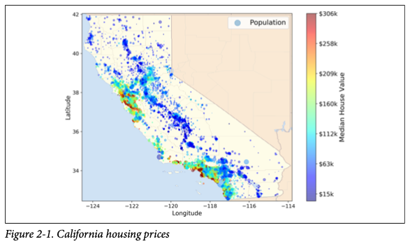
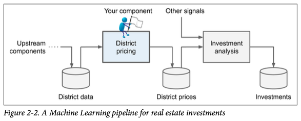
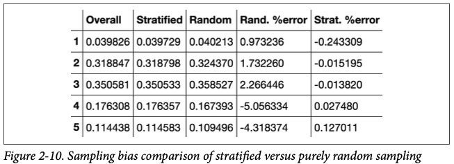
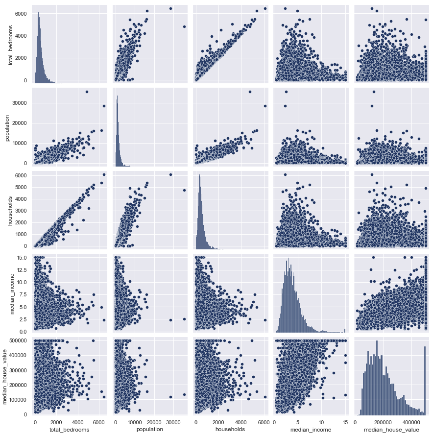

# 2. End-to-End ML Project

## Working with Real Data

The main steps author goes through in this chapter are:

1. Look at the big picture.
2. Get the data.
3. Discover and visualize the data to gain insights.
4. Prepare the data for Machine Learning algorithms.
5. Select a model and train it.
6. Fine-tune your model.
7. Present your solution.
8. Launch, monitor, and maintain your system.

In this chapter, the author goes through a project in which the goal is to predict the median housing price in any district using the Californa Housing Prices [dataset](https://www.kaggle.com/camnugent/california-housing-prices). 



You are pretending to be a recently hired Data Scientist at a real estate company. Following the steps above you are expected to create a machine learning model that will be fed to another ML system, along with many other signals \(a piece of information is called **signal**\). Below is an example visualization of an ML pipeline for real estate investments.




**Pipelines:** A sequence of data processing components is called a data _pipeline_. Pipelines are de facto standards of Machine Learning systems since there is a lot of data to preprocess and various transformations to apply.



Below the definitions of two concepts often mistaken for each other are given:

**Multiple Regression:**  A regression model that consists of multiple features called a _multiple \(univariate if one target variable exists\) regression model_. 

\( multiple-univariate regression $$ \rightarrow y = w_1 x_1 + .. + w_n x_n + b = WX + b)$$



**Multivariate Regression:** A regression model in which the numbers of target variables are more than one is called a _multivariate regression model_. 

\( multivariate-multiple $$ \rightarrow y_1 = W_1 X + b_1 \\  ............................... \\ \rightarrow y_n= W_n X +b_n $$ where $$X$$ is feature matrix.\)


Notice, the feature matrix is $$ m × n $$ \(num. of samples x num. features\), can also be written as a \(horizontal\) stack of feature vectors that are $$ m × 1 $$ column vectors. However, one can also write it starting with an $$(m \times 1)$$vector of $$ 1 $$'s and include bias term inside the weight matrix $$W.$$ This is often used in linear regression settings; however, $$W \ \text{and} \ b$$ are used frequently in neural networks setting. This notation will help to adjust DL notations easier.

$$\ \bold{X} = \begin{bmatrix}  x_{1}^{1}&x_{1}^{2}&\cdots &x_{1}^{n} \\ x_{2}^{1}&x_{2}^{2}&\cdots &x_{2}^{n} \\  \vdots & \vdots & \ddots & \vdots\\ x_{m}^{1}&x_{n}^{2}&\cdots &x_{m}^{n}  \end{bmatrix} =   \begin{bmatrix}  \vdots & \vdots & \vdots & \vdots\\ \bold{x^{1}}&\bold{x^{2}}&\cdots &\bold{x^{n}} \\  \vdots & \vdots & \vdots & \vdots\\  \end{bmatrix},  \bold{W} = \begin{bmatrix}  w_{1} \\ w_{2}\\ \vdots \\  w_{n} \end{bmatrix},  \bold{b} = \begin{bmatrix}   b_{1} \\ b_{2}\\ \vdots \\  b_{n} \end{bmatrix}$$

## Select a Performance Measure

In the book, the prediction of sample$$i$$is represented by $$ \hat{y}^{(i)} = h (x^{(i)}).$$ We will use $$ \hat{y}^{(i)}$$here. Some of the most common loss functions used in regression are \(I included more\): 

**Mean Squared Error:**         $$ \text{MSE} = \dfrac{1}{m} \sum\limits_{i=1}^{m} (y^{(i)} - \hat{y}^{(i)})^2 = \dfrac{1}{m} ||y - \hat{y}||_{\ell^2}^2 $$\*\*\*\*

This is simply a _rescaled_ version of a _**squared**_ $$\bold{\ell^2}$$ **\(Euclidean\) norm** of the error vector.

**Root Mean Square Error:** $$ \text{RMSE} =  \sqrt{\dfrac{1}{m}\sum\limits_{i=1}^{m} (y^{(i)} - \hat{y}^{(i)})^2} = \dfrac{1}{\sqrt{m}} ||y - \hat{y}||_{\ell^2}$$\*\*\*\*

Again, this is another _rescaled_ version of an $$\bold{\ell^2}$$ **\(Euclidean\) norm** of the error vector.

**Mean Absolute Error:**  $$\text{MAE} = \dfrac{1}{m} \sum\limits_{i=1}^{m} |y^{(i)} - \hat{y}^{(i)}| = \dfrac{1}{m} ||y - \hat{y}||_{\ell^1}$$\*\*\*\*

This error is a _rescaled_ version of an $$\bold{\ell^1}$$**\(Manhattan\) norm** of the error vector.

**Root Mean Absolute Error:**  $$\text{MAE} = \sqrt{\dfrac{1}{m} \sum\limits_{i=1}^{m} |y^{(i)} - \hat{y}^{(i)}| }= \sqrt{\dfrac{1}{m} ||y - \hat{y}||_{\ell^1}}$$\*\*\*\*

This is again a r_escaled_ version of the _**square root**_ of an$$\bold{\ell^1}$$**\(Manhattan\) norm** of the error.


In general, the $$\bold{k^{th}}$$ **vector norm** is given by: $$ ||x||_{\ell^k} = ||x||_{k} = \Bigg(\sum\limits_{i=1}^{n} |x_i|^k \Bigg)^{\frac{1}{k}} $$ 


Some of the notes about vector norms:

* **RMSE** corresponds to the **Euclidean** norm, whereas **MAE** does to the **Manhattan** norm.
* $$||x ||_{\ell^0}$$ gives the number of nonzero elements of $$\bold{x},$$ and $$|| x ||_{\ell^{∞}}$$ the maximum of absolute values of components of$$\bold{x}.$$
* The higher the norm index$$k$$, the more $$||y - \hat{y}||_{\ell^k}$$ focuses on large values, and the effects of small ones become negligible. Therefore, **RMSE** is more sensitive to _outliers_ than the **MAE**. But, when _outliers_ are exponentially _rare_ \(like in normal curve\), the **RMSE** outperforms **MAE** and it is preferred, in general.

## Percentiles and Quartiles


\*\*\*\*[**Quantile:**](https://wiki2.org/en/Quantile) ****They are cut points dividing the range of a probability distribution into continuous intervals with _equal probabilities_, or dividing the observations in a sample in the same way.



\*\*\*\*[**Percentile:**](https://wiki2.org/en/Percentile) ****The value below which k-percentage of the observations fall is called $$k^{th}$$ _percentile_.



\*\*\*\*[**Quartile:**](https://wiki2.org/en/Quartile) A _quartile_ is a type of quantile which divides the number of data points into _four_ more or less equal parts or quarters.


**Example**: The $$50 \%$$ _percentile_ is the $$2^{nd}$$_quartile_ and it is commonly known as the **median**.



**Note:** The standard deviation of the population is denoted by $$\sigma \ ($$sample std with $$s),$$ and it is the square root of the **variance**, which is the average of the squared deviation from the **mean**. When a feature has bell-shaped \(Gaussian, or normal\) distribution, the $$68-95-99.7$$ rule applies: about $$68 \%$$ of the values fall within $$1\sigma$$ of the mean, $$95 \%$$ within $$2\sigma,$$ $$99.7 \%$$within $$3\sigma.$$ This is very important as it is commonly used while finding **confidence intervals**.


## Splitting data into Train & Test 

The easiest way to split a given data into train and test sets is by using`sklearn`'s `train_test_split`method.

```python
from sklearn.model_selection import train_test_split

X_train, X_test = train_test_split(data,test_size=0.2,random_state=1)
```

The `random_state` parameter is used to reproduce results while using random generators. Otherwise' each time you use a random generator, you will get a different \(random\) answer. This method of splitting data is fine if the dataset is _large enough_ \(compared to the num. of features\), but if it is **not**, then it may produce significant **sampling bias**. Some of the common bias types in statistics are explained [here](https://data36.com/statistical-bias-types-explained/).


**Sampling bias:** In statistics, **sampling bias** is a bias in which a sample is collected in such a way that some members of the intended population have a lower or higher sampling probability than others. 


In order to avoid sampling bias, we can utilize **stratified sampling**: the population is divided into homogeneous subgroups called **strata**, and the right number of instances are sampled from each **stratum** to guarantee that the test set is representative of the overall population. Stratified sampling \(into 5 strata\) can be achieved by using `pandas`' s `cut` method together with `sklearn`'s `StratifiedShuffleSplit` object as given below:

```python
data['target'] = pd.cut(data['target'], 
                        bins=[0., 1.5, 3.0, 4.5, 6., np.inf],
                        labels=[1, 2, 3, 4, 5])

from skelarn.model_selection import StratifiedShuffleSplit
split = StratifiedShuffleSplit(n_splits=1, test_size=1, random_state=0)

for train_idx, test_idx split.split(data, data['target']):
    strat_X_train = data.loc[train_idx]
    strat_X_test  = data.loc[test_idx]
```


The **main idea** in `StratifiedShuffleSplit` is that train and test sets will follow an almost equal distribution of categories. Check the figure below.


The test set generated using stratified sampling would have income category proportions almost identical to those in the full dataset, whereas the test set generated using purely random sampling will be skewed. Below is the results of the sampling experiment:



Finally, by removing the target variable, you can select train and test sets to its original state.

```python
for set_ in (strat_X_train, strat_X_test):
    set_.drop('Target', axis = 1, inplace = True)
```

## Visualize the Data to Gain Insights

You can plot some portion of the data either using`seaborn`'s `scatterplot` or `pairplot`methods. The example below uses `pairplot.`

```python
import matplotlib.pyplot as plt
import seaborn as sns
sns.set(style = 'darkgrid', palette = 'Paired')

plt.figure(figsize = (16, 16))

#assuming data is fairly small (otherwise, only plot useful features)
sns.pairplot(data) 
```




