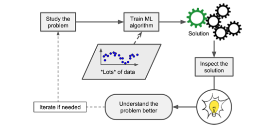
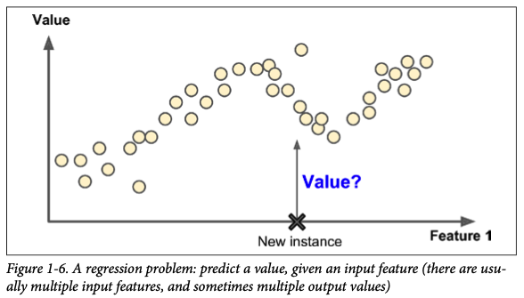
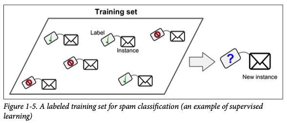
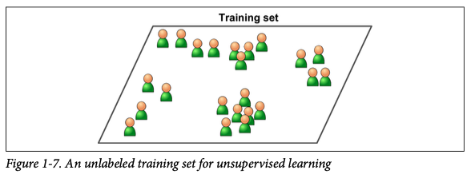
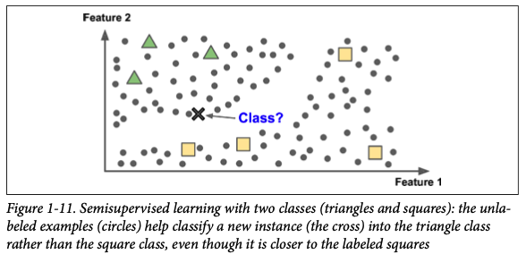
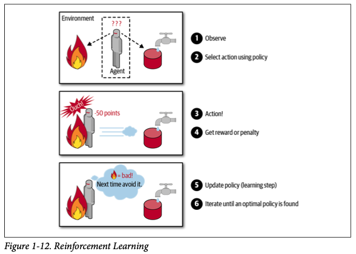
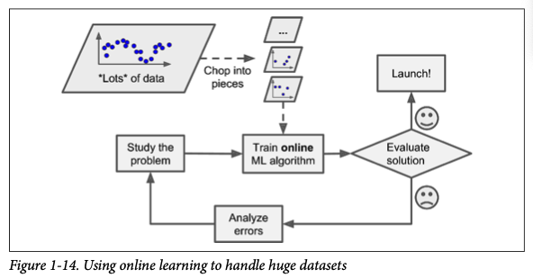
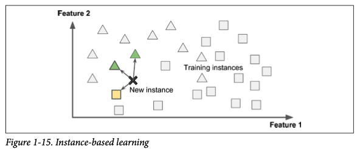
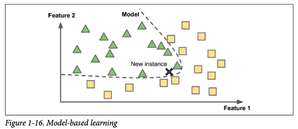
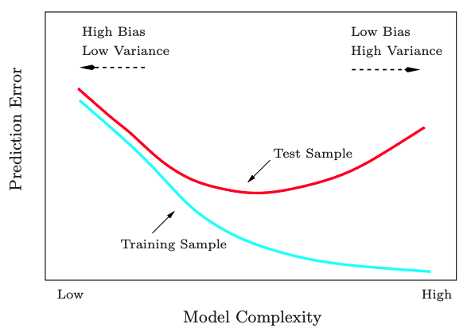

# 1. The ML Landscape

## **What is Machine Learning?**


**Basic:** Machine Learning is the science of programming computers so they can _learn from data_.



**General:** Machine Learning is the field of study that gives computers the _ability to learn without being explicitly programmed_. — Arthur Samuel, 1959



**Engr-oriented:** A computer program is said to _learn_ from _experience_ **E** with respect to some _task_ **T** and some _performance measure_ **P**, if its _performance_ on **T**, as _measured_ by **P**, _improves with experience_ **E**. — Tom Mitchell, 1997


Some of the applications of Machine Learning are:

* Forecasting revenue for the next year, based on past performance metric \(**regression**\)
* Detecting tumors in brain scans \(**classification** - semantic segmentation\)
* Segmenting clients based on their purchasing behaviors \(**clustering**\)
* Detecting fraudulent credit card transactions \(**anomaly detection**\)
* Recommending a product to clients based on past purchases \(**recommender system**\)
* Automatically classifying news articles \(**natural language processing**\)
* Analyzing images of products to automatically classify them \(**image classification**\)
* Creating an app to react to voice commands \(**speech recognition**\)
* Building intelligent bots for games \(**reinforcement learning**\), etc.



## Types of ML Systems

There are multiple types of Machine Learning systems, so it is often useful to classify them based on the following criteria:

* Whether or not they are trained with **human supervision** 
  * _supervised, unsupervised, semi-supervised_, and _reinforcement learning_
* Whether or not they can **learn** incrementally **on the fly**
  * _online_ vs. _batch learning_
* Whether they work by simply **comparing** **new** data points **to known** data points, or instead by **detecting patterns** in the training data and **building a predictive model**
  * _instance-based_ vs. _model-based learning_


These criteria are **not exclusive**; you can combine them in any way you like. For example, a state-of-the-art spam filter may learn on the fly using a DNN model trained using examples of spam and ham; this makes it an **online**, **model-based**, **supervised** learning system.


### Supervised Learning

In **supervised learning,** the training set fed into an algorithm includes the desired solutions \(target variable\) called _labels_, beforehand.

Typical supervised learning tasks are **regression** and **classification** whose target variables consist of _numerical_ and _categorical_ variables, responsively. 



An example of a **regression** problem would be predicting the price of a car, where given a set of _features_ \(mileage, age, brand, etc.\), called _predictors_, the task is to predict a _target_ numeric \(continuous\) value. Notice, not every numeric value is used for continuous variables. Numerical values taking a finite number of options are often used for categorical variables.



An example of a **classification** problem would be a spam filter, where the training samples are given along with their \(binary\) class: _spam_ or _ham_ \(1 or 0\). 

Below are some of the most important supervised learning algorithms:

* Linear Regression
* Logistic Regression
* k-Nearest Neighbors \(kNN\)
* Support Vector Machines \(SVM\)
* Decision Trees and Random Forests
* Neural Networks, etc.


**Note 1:** Some of the algorithms - such as Random Forests - can be used for both _regression_ and _classification_ problems.



**Note 2:** Some neural network architectures can be _unsupervised_, such as _autoencoders_ and _restricted Boltzmann machines_. They can also be _semi-supervised_, such as in _deep belief networks_ and _unsupervised pretraining_.


### Unsupervised Learning

In contrast to _supervised_ learning, in **unsupervised** **learning** the training data is unlabeled. The algorithms try to learn without human supervision.



Here are some of the most important unsupervised learning algorithms:

* **Clustering**
  *  K-Means
  * DBSCAN
  * Hierarchical Cluster Analysis \(HCA\)
* **Anomaly detection and novelty detection**
  * One-class SVM
  * Isolation Forest
* **Visualization and dimensionality reduction**
  * Principal Component Analysis \(PCA\)
  * Kernel PCA
  * Locally Linear Embedding \(LLE\)
  * t-Distributed Stochastic Neighbor Embedding \(t-SNE\)
* **Association rule learning**
  * Apriori
  * Eclat

If you have a lot of data about your website's visitors, you can use **clustering** algorithms to try to detect the groups of similar visitors. Using a **hierarchical clustering** algorithm, you may also divide each group into smaller groups.

**Anomaly detection** can be used for detecting unusual credit card transactions to prevent fraudulent activities and alert customers to take action. A similar task is **novelty detection**, which targets to detect new instances that look from the rest of the instances in the training set.

**Visualization** and **dimensionality reduction** algorithms are good examples of unsupervised learning since you feed them a lot of complex and unlabeled data and they output smaller dimensions, often in 2D or 3D, representation of the data that can easily be plotted. These algorithms try to preserve the structure of the data \(or minimize the loss of information\) in order to help you understand how the data is organized and identify unusual patterns.


It is often a good idea to try to r**educe the dimension** of your training data using a dimensionality reduction algorithm before you feed it to another Machine Learning algorithm \(such as a super‐ vised learning algorithm\). It will run much **faster**, the data will take up **less** **disk** and **memory space**, and in some cases, it may also _perform better_.


Finally, another common unsupervised task is association **rule learning**, in which the goal is to dig into large amounts of data and discover interesting relations between attributes.

### Semi-supervised Learning

Notice, labeling data is usually _time-consuming_ and _costly,_ as a result often you will end up with plenty of _unlabeled_ instances, and few _labeled_ instances. Some algorithms can deal with data that’s partially labeled. These are called **semi-supervised learning** algorithms.



Most semi-supervised learning algorithms are combinations of **unsupervised** and **supervised** algorithms. For example, _deep belief networks_ \(DBNs\) are based on _unsupervised_ components called _restricted Boltzmann machines_ \(RBMs\) stacked on top of one another. RBMs are trained sequentially in an _unsupervised_ manner, and then the whole system is fine-tuned using _supervised_ learning techniques.

### Reinforcement Learning

In **Reinforcement Learning,** the learning system - called an **agent** - can observe the environment, select and perform actions to maximize rewards and/or minimize penalties. At its final stage, the agent must learn the best strategy - called a **policy** - to maximize reward over time. A _policy_ defines the action which should be taken in a given situation.



For example, robots - in general - implement _Reinforcement Learning_ algorithms to learn how to walk. DeepMind’s **AlphaGo** program is also a good example of RL: It beat the world champion Ke Jie at the game of Go, by learning its winning policy after analyzing millions of games and then playing many games against itself. Learning was turned off during the games; AlphaGo was just applying the _policy_ it had _learned_.

### Batch vs Online Learning

In **batch learning**, the system is **incapable** of learning incrementally, that is, the algorithm should be trained using all of the data available \(slow and costly\). In general, this process would take plenty of time and resources; hence, it is typically implemented _offline_. As in the AlphaGo example above, first, the system is trained on the data, and then it is launched into production in which step it applies what it has learned. This type of learning called **offline learning**.



In **online learning**, the system is capable of learning incrementally, that is, the algorithm is being fed data sequentially, either individually \(**batch**\) or in smaller groups \(**mini-batches**\). Since each learning step is fast and cheap, the system can learn about the instance on the fly, as it arrives. If the dataset is so large that it doesn't fit in the system's machine's memory, the algorithm can load parts of the data and run online learning on the part until it has run on all of the data. This is called _out-of-core learning._

### Instance vs Model Based Learning

Another way to categorize ML systems is by how they _generalize: instance_ or _model-based._



In **instance-based learning**, ****the system learns the examples by heart and then generalizes them to new instances using a similarity measure to compare them to learned examples.



In **model-based learning**, a set of examples is used to build a model, and then the model is used to make _predictions_.

## Main Challenges of ML

Notice that our main task is to pick a learning **algorithm** and train it on some **data**; thus, there are two main ingredients that can cause problems: _bad data_ and _bad algorithms_.

### Bad Data

The first group of challenges is due to _bad data_, and they are self-explanatory. I presented some of the possible solutions to tackle the challenges.

* Insufficient Quantity of Training Data - **More data required** 
  * Collect more data
* Nonrepresentative Training Data - **Better sampling required**
  * Check if the sampling method is flawed
* Poor-Quality Data - **Data cleaning required**
  * Detect and treat missing values in the features
  * Detect and treat high leverage points and outliers
* Irrelevant Features - **Feature Engineering required**
  * Use feature selection and extraction
  * Create new \(more useful\) features if possible

### Bad Algorithms

The second group of challenges is due to _bad algorithms_.

* Overfitting the Training Data
* Underfitting the Training Data

Let's first talk about the bias-variance tradeoff before algorithm based challenges: overfitting and underfitting.

> In [statistics](https://wiki2.org/en/Statistics) and [machine learning](https://wiki2.org/en/Machine_learning), the **bias–variance tradeoff** is the property of a model that the [variance](https://wiki2.org/en/Variance) of the parameter estimates across [samples](https://wiki2.org/en/Sample_%28statistics%29) can be reduced by increasing the [bias](https://wiki2.org/en/Bias_of_an_estimator) in the [estimated](https://wiki2.org/en/Estimation_theory) [parameters](https://wiki2.org/en/Statistical_parameter). The **bias–variance dilemma** or **bias–variance problem** is the conflict in trying to simultaneously minimize these two sources of [error](https://wiki2.org/en/Errors_and_residuals_in_statistics) that prevent [supervised learning](https://wiki2.org/en/Supervised_learning) algorithms from generalizing beyond their [training set](https://wiki2.org/en/Training_set). - Wikipedia

Let's assume $$y = f(X) + ε$$- where $$\epsilon$$ is the _white noise_  $$E[\epsilon]=0$$ and is independent of $$X$$- is the **actual** target variable, whereas $$\hat{f}(X)$$ represents the **predicted** target variable of the model. Then, the mathematical derivation of bias-variance tradeoff is given by decomposition of the expected prediction error \(a.k.a. test or generalization error\):


where the second terms $${\sigma}^2$$ is the irreducible error - the variance of the new target - and is beyond our control, even if we know the actual target value. The above equation simply states that the only part of the generalization error, that is in our control, is bias and variance of the predicted variable. For the error depends on their sum, they are inversely related to each other, i.e., one will increase as the other decreases. This is called a **bias-variance tradeoff**. The ultimate goal of an ML model is to minimize both of them as much as possible. However, we will see that as one of them increases the model will tend to underfit or overfit, responsively. Below is a good example of how prediction error behaves as model complexity changes.



Overgeneralizing things - due to overfocusing past knowledge - is something that humans do all the time, and similarly, machines can fall into the same trap if the model focuses too much on the training data. As the model performs too well on the training data, it overfocuses the training data points; hence, cannot generalize well to unseen data. This is called **overfitting**. This happens when the model is too **complex** \(**high variance**\), and the _prediction of training_ instances is **almost perfect** \(**low bias**\). Overfitting might also happen if the training set is too noisy or it is too small \(which can introduce sampling noise\), then the model is likely to learn patterns in the noise as well. Since the new instances come up with different patterns, the model won't generalize well. Possible solutions to prevent overfitting:

* Reduce the complexity of model \(either decrease \# of features or change the model\)
* Obtain more training data so that model cannot overfocus data points
* Reduce the noise in the training data by fixing data errors and/or treating outliers
* Add a regularization method to increase bias \(constrain the learnable parameters\)

On the other hand, when your model is too simple to learn the underlying complexity of the data, the model tends to predict both training and the test data **poorly**. In this case, the model **cannot differentiate** between data points \(**low variance**\) and the _prediction of training_ instances are also **not** quite **accurate** \(**high bias**\). Possible solutions to prevent underfitting:

* Increase the complexity of model \(either increase \# of feature or improve the model\)
* Feed better features to algorithm utilizing feature engineering
* Reduce the constraints on the model \(e. g., reduce the regularization hyperparameter\)

## Testing and Validating

The only way to know how well our model will generalize to unseen data is by trying it out on new cases. One can achieve this by splitting the complete data into two sets: **training** and **test sets**. As the names suggest, you training your model in the training set \(don't touch the test set while optimizing your parameters\) and then you test how well your model works using the test set. By evaluating your model on the test set, you get an idea of how well your model would perform on instances that the model has never seen before. If the training error low whereas the test error is high, this is a good implication of **overfitting** the training data. If both of the errors are low, then there is a chance if the model is **underfitting** \(assuming that better performance is possible\) the data. In general, allocating 80% of the data for training and 20% for test is a common approach. However, when the dataset is large \(&gt; 1 million samples\), a fraction of 99% to 1% might even be a good choice, since &gt;10,000 data for testing would most likely be enough to evaluate the model performance.

### Hyperparameter Tuning and Model Selection

Using a training and test set makes the model evaluation simple enough. But, how can we decide which one to use between two different models? One option is to train both and compare their generalization error using the test set. However, the problem occurs when you measure the error multiple times on the test set, and you adapted the model and hyperparameters to produce the best model for _that particular test set_. This means the model is unlikely to perform well on new data.

A common solution to this problem is called **hold-out validation**: simply hold out some part of the training set to evaluate several candidate models and select the best one. The new held-out set is often called the **validation** \(development, or simply dev\) **set**. Now, you don't have to worry about adapting hyperparameters on the test set, rather you would select them according to their performance on the _validation set_. Then you train the best model on the full training set \(train + validation\) to get the **final model**. Finally, you would evaluate this model on the _test set_ to get an estimate of the generalization error.

In the case the validation set is too _small_ or too _large_, then model evaluations will be _imprecise_ or _non-representative_ of the full training set \(since the rest is much smaller\), responsively. To prevent these problems one can perform repeated **cross-validation**, using many small validation sets. Each model is _evaluated_ on validation after it is trained on the rest of the data. Then, averaging the evaluation scores would yield a much accurate measure of the performance. On the other hand, this is a _drawback_ since it multiplies the training time by the number of validation sets.

### Data Mismatch

This part of the notes consists of advice given by Andrew Ng which you can find in his book [Machine Learning Yearning](https://www.deeplearning.ai/machine-learning-yearning/) or on his ML Course \(one of my favs\)[ @ Coursera](https://www.coursera.org/learn/machine-learning?utm_source=gg&utm_medium=sem&utm_campaign=07-StanfordML-US&utm_content=07-StanfordML-US&campaignid=685340575&adgroupid=52515609594&device=c&keyword=machine%20learning%20mooc&matchtype=b&network=g&devicemodel=&adpostion=&creativeid=243289762946&hide_mobile_promo&gclid=Cj0KCQjw8fr7BRDSARIsAK0Qqr457L47D0puHVHlN3g12J68dQ702DwuPMT5fLIEavktONZVExgOhzAaAqn6EALw_wcB).

Choose dev and test sets to reflect data you expect to feed into your model in the future and want to do well on. To do this, first, you need to make sure your **validation** and **test sets** come from the _same distribution_. Because if the dev and test sets come from different distributions, it is **unclear** what is the main reason that your model generalizes poorly. There are three things that could have gone wrong:

* Your model overfits to the validation set \(or training set\)
* The test set is harder to learn than the dev set, i.e., your algorithm might be doing as well as could be expected, but no further significant improvement is possible
* The test set is not necessarily harder to learn, but just different from the dev set. So what works well on the dev set doesn't work well on the test set, in which case you should avoid wasting too much time on improving the dev set

### Data Leakage

I wanted to add this topic since it is very important and somehow was not included in the book. The source of these notes is Kaggle's [Data Leakage](https://www.kaggle.com/alexisbcook/data-leakage) section in [Intermediate Machine Learning](https://www.kaggle.com/learn/intermediate-machine-learning) mini-course. 

Sometimes even though the model yields a very high-performance metric on the test set but generalizes very poorly to unseen data because there is a data leakage between training and test datasets. 


**Data leakage:** It happens when your training data contains information about the target, but similar data will **not** be available when the model is used for prediction. This leads to high performance on the training set \(and possibly even the validation data\), but the model will perform _poorly in production_.


In short, data leakage causes overly optimistic results; however, the model makes very inaccurate predictions in production. There are two main types of data leakage:

* **Target leakage**
* **Train-test contamination**

**Target leakage** occurs when the predictions include data that will **not** be available at the time you make _predictions in production_. It is important to think of target leakage in terms of the timing or chronological order that data becomes available, not whether a feature helps making good predictions. An example given in the mini-course is:

> People take antibiotic medicines _after_ getting pneumonia in order to recover. The raw data shows a strong relationship between those columns, but `took_antibiotic_medicine` is frequently changed _after_ the value for `got_pneumonia` is determined. This is target leakage.

In order to prevent this type of data leakage, variables updated or created after the target value's value is realized should be excluded from the model.

A different type of leak occurs when the training and validation data are not distinguished. Validation is only used to measure how well the model performs on the unseen data. There are multiple ways to corrupt this process in subtle ways if the validation data affects preprocessing behavior. This type of leakage is called **train-test contamination**. An example of this would occur when using standardization used negligently. For example, when using sklearn's StandardScaler object, you first create an instance. Let's call it scaler. Then, you would fit the training data to obtain the mean and standard deviation of the data.

$$
μ = \dfrac{1}{N} \sum_{i=1}^{N} x_{train} ,\quad \sigma = \sqrt{ \dfrac{1}{N} \sum_{i=1}^{N} (\mu_{train} - x_{train})^2}
$$

Then, using those parameters you would transform \(scale\) the training and test data:

$$
z_{train}^{i} = \dfrac{x_{train}^{i} - \mu}{\sigma}, \quad z_{test}^{i} = \dfrac{x_{test}^{i} - \mu}{\sigma}
$$

This would calculate standardized values of each variable in training and test sets. Notice, after this transformation only training set would have **zero** _mean_, and **unit** _stand. deviation_.


Notice the implementation of the scaler below is incorrect since the test data transformed using its own parameters. This leads to train-test contamination because we will get an idea about the mean and standard deviation of test data.


```python
from sklearn.preprocessing import StandardScaler

scaler1   = StandardScaler()
std_train = scaler1.fit_tranform(train_data)
std_test  = scaler1.fit_tranform(test_data)
```


The correct implementation of scaling is that one first fits the training data and then using the parameters to transform each data accordingly. This way we will only use mean and standard deviation obtained from training data and scale test data using those parameters; hence, we will avoid train-test contamination.


```python
from sklearn.preprocessing import StandardScaler

scaler2   = StandardScaler()
std_train = scaler2.fit_tranform(train_data)
std_test  = scaler2.transform(test_data)
```

### No Free Lunch Theorem

In a famous [paper](https://citeseerx.ist.psu.edu/viewdoc/download?doi=10.1.1.390.9412&rep=rep1&type=pdf), in 1996, David Wolpert shows that under no assumptions about the data, there is no distinction between models. This is called the **No Free Lunch \(NFL\) theorem**. In short, for some datasets, the best model is a linear regression model, whereas it is a neural network for other datasets. Hence, there is no model that is guaranteed to work better in advance. The only way to know for sure is to evaluate them all and compare the results. In practice, this is not possible nor practical, so we need to make some reasonable assumptions about the data and evaluate only a reasonable set of models.

## Answers to Exercises

**Problem 1: How would you define Machine Learning?**

I really like the definition given by Arthur Samuel since it is quite clear. So mine would be very close to his definition.

> Machine Learning is the field of study that seeks to improve giving computers the ability to learn without being explicitly instructed to do so.

**Problem 2: Can you name four types of problems where it shines?**

1. Classification
2. Natural Language Processing
3. Image classification
4. Reinforcement learning

**Problem 3: What is a labeled training set?**

It is a subset of data that comes with actual target values called labels.

**Problem 4: What are the two most common supervised tasks?**

* Regression
* Classification

**Problem 5: Can you name four common unsupervised tasks?**

1. Clustering \(K-Means, Hierarchical Cluster Analysis, etc.\)
2. Dimensionality reduction \(PCA, Kernel PCA, etc.\)
3. Anomaly & Novelty detection \(One-class SVM, Isolation forest, etc.\)
4. Association rule learning \(Apriori, Eclat, etc.\)

**Problem 6: What type of Machine Learning algorithm would you use to allow a robot to walk in various unknown terrains?**

* Reinforcement learning

**Problem 7: What type of algorithm would you use to segment your customers into multiple groups?**

* Clustering algorithms such as K-Means

**Problem 8: Would you frame the problem of spam detection as a supervised learning problem or an unsupervised learning problem?**

* Supervised since it is a binary classification problem

**Problem 9: What is an online learning system?**

* It is the type of learning system in which the system is itself is capable of learning incrementally, i.e. the algorithm is being fed data sequentially, either individually \(**batch**\) or in smaller groups \(**mini-batches**\). Due to its speed and \(computing\) cost friendliness, the system can learn about the instance on the fly.

**Problem 10: What is out-of-core learning?**

* In an online learning system, if the dataset is so large that it doesn't fit in the machine memory, then the algorithm can load parts of the data and run on split parts until all of the parts are run. This process is called **out-of-core learning**_._

**Problem 11: What type of learning algorithm relies on a similarity measure to make predictions?**

* Instance-based algorithms run on the current instance and then generalize it for the new instances using a similarity measure comparison with learned examples

**Problem 12: What is the difference between a model parameter and a learning algorithm’s hyperparameter?**

* A model parameter is the parameter model that tries to optimize to minimize the given metric such as cost function. A learning algorithm's hyperparameter is a parameter that belongs to the algorithm that helps optimizing its performance rather than the model itself.

**Problem 13: What do model-based learning algorithms search for? What is the most common strategy they use to succeed? How do they make predictions?**

* They search for optimal parameters so that model generalizes well to new instances \(e.g. minimizing the cost function\). Tuning hyperparameters to improve model performance is one of the strategies. They use the optimized parameters to make predictions on the new data. 

**Problem 14: Can you name four of the main challenges in Machine Learning?**

* Insufficient amount of data
* Non-representativeness of the data
* Bad Quality data
* Overfitting - underfitting

**Problem 15: If your model performs great on the training data but generalizes poorly to new instances, what is happening? Can you name three possible solutions?**

* It is most likely because the model is overfitting the training data, i.e, it is either too complex or the test data is harder to learn \(i.e., they don't come from the same distribution\). Possible solutions to tackle these are:
  * Reducing the complexity of the model
  * Adding a regularization method
  * Feeding more data to the model
  * **Extra:** Reduce the noise by preprocessing data, or draw train-test from the same distribution

**Problem 16: What is a test set, and why would you want to use it?**

* Test set is a part of the data \(most of the time chosen from 10-30% of the data randomly\) and it is used to evaluate the model's performance before put into production

**Problem 17: What is the purpose of a validation set?**

* A set of data is often required to tune hyperparameters \(to compare different models\) to improve the model's performance; however, test data should **not** be used to tune hyperparameters since it would lead to data leakage. Thus, often we split data into three sets, training, validation, and test. The model trains on training set tuned on validation set, and it is evaluated using test set.

**Problem 18: What is the train-dev set, when do you need it, and how do you use it?**

* This is a tricky question. Andrew Ng explains this concept very clear in his course. Here is the answer from the book:
* The train-dev set is used when there is a risk of mismatch between the training data and the data used in the validation and test datasets \(which should always be as close as possible to the data used once the model is in production\). The train- dev set is a part of the training set that’s held out \(the model is not trained on it\). The model is trained on the rest of the training set and evaluated on both the train-dev set and the validation set. If the model performs well on the training set but not on the train-dev set, then the model is likely overfitting the training set. If it performs well on both the training set and the train-dev set, but not on the validation set, then there is probably a significant data mismatch between the training data and the validation + test data, and you should try to improve the training data to make it look more like the validation + test data.

**Problem 19: What can go wrong if you tune hyperparameters using the test set?**

* It leads to data leakage, hence an overly optimistic performance score. The model will only work very well on that test set, and will most likely not generalize well to new instances. 

\*\*\*\*

\*\*\*\*


\*\*\*\*


\*\*\*\*


